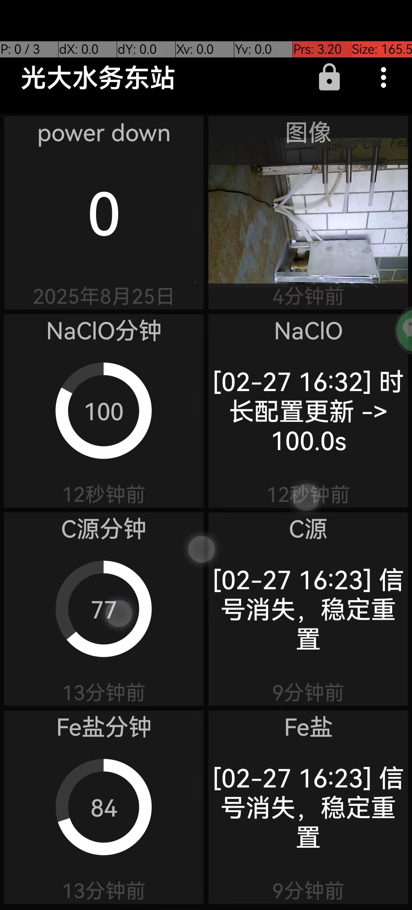

# Pi-Water 智能采样监控系统 - 用户手册 (V1.0)

## 1. 产品概述
**Pi-Water** 是一款专为工业现场设计的分布式智能液体采样控制系统。系统基于树莓派高性能边缘计算平台，集成多通道液位感知、精密时间序列控制与远程云端监控功能，旨在为环境监测与工业流体管理提供高可靠、自动化的采样解决方案。

---

## 2. 核心技术优势

### 2.1 三通道同步作业
系统预设三个独立监测通道，专为以下典型工业液体进行参数优化：
- **通道 1 (次氯酸钠适配型)**：优化采样周期 1.5 小时。
- **通道 2 (碳源适配型)**：优化采样周期 2.0 小时。
- **通道 3 (氯化铁适配型)**：优化采样周期 40 分钟。

### 2.2 工业级稳定触发逻辑 (Anti-Interference)
为消除液位波动产生的一过性非法触发，系统内置 **180秒 (3分钟) 冷静监测机制**。传感器信号必须在规定时间内保持物理稳定，系统方可判断为有效进样，从源头杜绝误操作风险。

### 2.3 动态 75% 采样效率算法
系统动态计算采样的黄金区间。在预测液流总时长的前 **75% 时间段** 内，自动均匀分配 3 次采样指令。这种“前置聚焦”设计确保了在液位排空风险增加的后期之前，已完成足额的样本采集。

### 2.4 全天候远程状态感知
集成 MQTT 通信协议，通过 **[远程实时日志]** 终端，技术人员可跨地域实时掌握每一路传感器的触发瞬间、水泵的启停状态及任务完成进度。

---

## 3. 硬件连接参考

| 组件名称 | 接口定义 | 说明 |
| :--- | :--- | :--- |
| **传感器通路 1-3** | GPIO 17, 27, 22 | 低电平触发型液位计 |
| **泵控通路 1-3** | GPIO 5, 6, 13 | 继电器驱动模块 (LOW-ON/HIGH-OFF) |
| **系统状态灯** | GPIO 26 | 5秒呼吸跳动，指示程序常驻后台 |
| **视觉监控器** | USB/CSI 摄像头 | 用于采样关键节点的现场图像固证 |

---

## 4. 远程操作指南

### 4.1 自动网络对时
系统内置 NTP 自动授时机制。设备联网后将自动同步至 `Asia/Shanghai` 时区。建议在采样日志中出现 `[DateTime]` 标记前，确保设备网络连通，以维持高精度的时间戳记录。

### 4.2 分通道实时日志
为实现消息的“历史化存储”与“极致精简”，系统现将各通道日志发布至独立主题：
- **主题映射**:
    - 通道 1: `pi_water/log/1`
    - 通道 2: `pi_water/log/2`
    - 通道 3: `pi_water/log/3`
- **格式示例**:
    > `[02-27 16:10] 传感器触发，等180秒进入稳定期`
    > `[02-27 16:13] 稳定通过，启动采样`
    > `[02-27 16:13] 泵：开`

### 4.3 远程动态时长配置
您可以不通过修改代码，通过远程指令实时调整各通道的“预期总时长”：
- **控制方式**: 向以下主题发送 **数字**（单位：秒）：
    - `pi_water/config/duration/1`
    - `pi_water/config/duration/2`
    - `pi_water/config/duration/3`
- **生效逻辑**: 系统接收到新数值后，会立即重新计算该通道的 3 次采样时间间隔。

---

## 6. 移动端软件操作指南

系统支持通过移动端监控桌面实时掌控现场状态。下图为典型的手机监控界面：

### 6.1 核心功能模块说明
- **图像监测窗 (右上)**：实时显示由树莓派摄像头拍摄的现场照片。在水泵启动延时 2 秒后，该窗口将自动刷新最新的抓拍画面。
- **状态拨盘 (左侧区域)**：
    - **NaClO/C源/Fe盐分钟**：以环形进度条形式展示各通道配置的“预期总时长”。
    - **数值显示**：中心数字表示当前的配置值（分钟）。
- **实时日志流 (右侧区域)**：
    - 展示各通道最新的 MQTT 通信日志，包含传感器触发、采样启动及水泵启停的精确时间。
- **Power Down (扩展项)**：
    - 用于监测系统下线或异常断电计数的扩展模块，确保故障可追溯。

### 6.2 远程调整参数
通过软件界面，点击对应液体的“分钟”设置区域，即可远程下发新的采样总时长。系统接收指令后会执行：
1. 更新内存配置。
2. 自动重算采样脉冲序列。
3. 在日志流中反馈“时长配置更新”确认消息。

---
*Pi-Water System: 让复杂的工业采样，变得智能且简单。*
