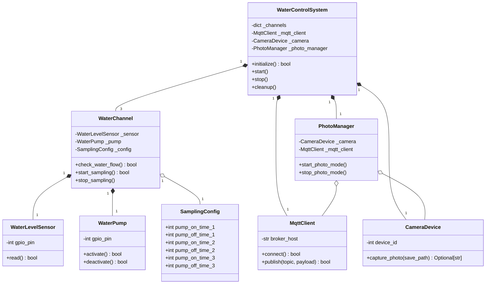

# 树莓派液位检测与水泵控制系统 - 关键类及关系视图

## 1. 系统架构图

下面的类图直观地展示了系统级别的层级调用与类的组合关系。所有具体的硬件设备及逻辑块都被聚合到了主控制系统 `WaterControlSystem` 中。



---

## 2. 核心类签名 (实现类)

本系统移除了不必要的抽象层，直接使用以下具体类来映射物理世界组件和对应的业务逻辑：

### 2.1 硬件控制类

#### `WaterLevelSensor` (液位传感器)
封装开关量输入的读取逻辑（配置为上拉电阻）。
```python
class WaterLevelSensor:
    def __init__(self, gpio_pin: int, sensor_id: str): ...
    def initialize(self) -> bool: ...
    def read(self) -> bool: ...
    def cleanup(self) -> None: ...
```

#### `WaterPump` (水泵)
封装控制水泵开/关的高低电平输出逻辑。
```python
class WaterPump:
    def __init__(self, gpio_pin: int, pump_id: str): ...
    def initialize(self) -> bool: ...
    def activate(self) -> bool: ...
    def deactivate(self) -> bool: ...
    def cleanup(self) -> None: ...
```

#### `CameraDevice` (USB摄像头)
调用 OpenCV (cv2) 设备进行快照拍照封装。
```python
class CameraDevice:
    def __init__(self, device_id: int = 0): ...
    def initialize(self) -> bool: ...
    def capture_photo(self, save_path: str) -> Optional[str]: ...
    def cleanup(self) -> None: ...
```

### 2.2 逻辑与通信类

#### `WaterChannel` (单一通道组合管理器)
聚合了一个 `WaterLevelSensor` 和一个 `WaterPump`，负责该通道内部的采样动作与6个采水状态（开、关等）的定时流转。
```python
class WaterChannel:
    def __init__(self, channel_id: str, sensor: WaterLevelSensor, pump: WaterPump, config: SamplingConfig): ...
    def initialize(self) -> bool: ...
    def check_water_flow(self) -> bool: ...
    def start_sampling(self) -> bool: ...
    def stop_sampling(self): ...
    def cleanup(self): ...
```

#### `PhotoManager` (相机定时调度)
依赖 `CameraDevice` 拍照，并通过 `MqttClient` 序列化并发送图像。包含条件触发的循环计时器。
```python
class PhotoManager:
    def __init__(self, camera: CameraDevice, mqtt_client: MqttClient, photo_interval: int = 300): ...
    def start_photo_mode(self): ...
    def stop_photo_mode(self): ...
```

#### `MqttClient` (消息队列客户端)
基于 `paho-mqtt` 客户端实现的阻塞并重连功能。负责发送运行状态与图像数据。
```python
class MqttClient:
    def __init__(self, broker_host: str, broker_port: int, username: str, password: str): ...
    def connect(self) -> bool: ...
    def disconnect(self): ...
    def publish(self, topic: str, payload: str, qos: int = 1) -> bool: ...
```

### 2.3 主入口

#### `WaterControlSystem` (中央调度器)
实例化三个通道对象，监听并派发整体状态控制指令。
```python
class WaterControlSystem:
    def __init__(self, config: dict): ...
    def initialize(self) -> bool: ...
    def start(self): ...
    def stop(self): ...
    def cleanup(self): ...
```